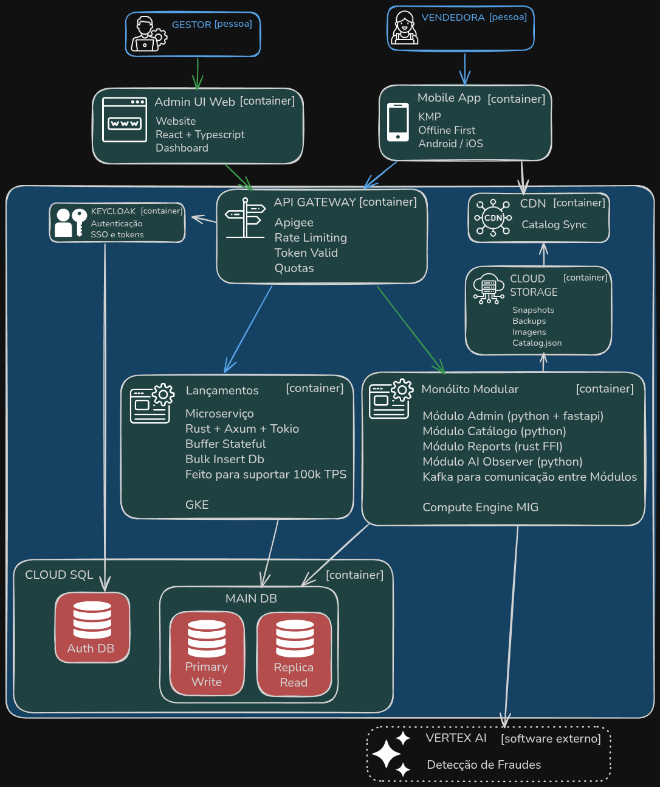

# Containers, Escalabilidade e Operação

## 1. Visão Geral dos Containers
| Container / Serviço | Descrição | Principais entradas | Saídas / Consumidores |
|---------------------|-----------|---------------------|-----------------------|
| **Lançamentos API** (Rust, Axum) | Microserviço crítico que mantém buffer em memória/WAL e grava lançamentos. | HTTP/REST `/v1/lancamentos` autenticado por Apigee; catálogo versionado; headers OIDC. | PostgreSQL (`lancamentos` + tabela de controle), métricas OTEL, eventos de consistência. |
| **Monólito FastAPI** | Container com módulos Admin, Catálogo, IA Observer API e orquestração de Reports. | Requisições REST do Admin UI, jobs Argo, eventos Kafka, consultas à réplica. | APIs internas, eventos Kafka, snapshots CDN, respostas Admin UI. |
| **Reports Worker** (Argo + Rust/Polars) | Pods efêmeros que processam consolidações, atualizam views e exportam Parquet. | Agendamentos Argo, dados PostgreSQL, manifestos de parâmetros. | Views `reports_*`, arquivos `gs://datalake/*.parquet`, APIs de relatório. |
| **AI Observer** | Submódulo que orquestra agentes LangChain e chama Gemini. | Eventos Kafka (`LancamentoRegistrado`), feature store, templates de prompt. | Alertas IA, notificações FCM/Admin, logs SIEM. |
| **Catálogo Publisher** | Job GitLab programado que gera snapshots e publica no Cloud Storage/CDN. | Dados Catálogo, CSV importados, versão atual. | Snapshot `catalog_version`, Signed URLs, hashes de integridade. |
| **Keycloak** | Identidade OIDC/MFA, RBAC e federation. | Fluxos OIDC/PKCE (apps/admin), integrações Apigee. | Tokens JWT, claims, refresh tokens, eventos de auditoria. |
| **Apigee Gateway** | Borda REST com quotas, validação JWT e observabilidade. | Chamadas HTTPS externas. | Requisições com headers de identidade (`X-User-Id`, `X-Roles`). |
| **GitLab Runners** | Infra de CI/CD (lint, test, security, build, deploy). | Commits/MRs, `.gitlab-ci.yml`. | Imagens Docker, artefatos KMP, manifestos Terraform/Helm. Provisionados como 2 VMs n2-standard-4 preemptíveis com autoscaling. |
| **Observabilidade Stack** | OTEL Collector, Cloud Monitoring/Logging, PagerDuty. | Traces, métricas e logs dos serviços. | Dashboards SLO, alertas, relatórios MTTR/MTTD. |

## 2. Escalabilidade
- **Lançamentos API**: HPA por CPU/latência (n2-standard-2 → n2-standard-4), buffer parametrizável (size, flush 10 s), readiness baseado em backlog/WAL.
- **Monólito FastAPI**: MIG ativo/standby (2x n2-standard-4), opção de escalar horizontalmente para até 4 VMs conforme CPU > 60%; caching leve e CDN reduzem GETs.
- **Reports Worker**: Argo Workflows dispara pods n2-highmem-4 fora do horário de pico; paralelismo configurável e ephemeral storage alto para Polars.
- **AI Observer**: Execução assíncrona limitada por fila interna; throttling de prompts e fallback para modelos locais.
- **Keycloak**: 2 pods HA, HPA por CPU, state compartilhado com Infinispan; DB dedicado absorve burst de sessões.
- **Apigee**: autoscaling gerenciado; quotas/RatePlans controlam pressão sobre backends.
- **GitLab Runners**: autoscaling com duas instâncias n2-standard-4 preemptíveis (6 jobs concorrentes) para evitar saturação do Registry.
- **Observabilidade**: Cloud Monitoring escala automaticamente; centralizo dashboards por domínio.

## 3. Resiliência
- **Retry/backoff**: Clientes móveis utilizam retries exponenciais; AI Observer reaplica eventos idempotentes.
- **Circuit breaker**: Políticas Apigee evitam cascatas; o monólito possui fallback de leitura em réplica.
- **Idempotência**: `request_id` no Lançamentos API, outbox SQLite nos apps, reaplicação segura no backend.
- **Failover**: Cloud SQL failover < 1 min, MIG blue/green com rollback e GKE PDB + pod anti-affinity.
- **DR**: Backups PITR, replicação semanal cross-region, snapshots CDN versionados; RPO ≤ 5 min, RTO ≤ 15 min.
- **Chaos engineering**: Executo cenários trimestrais (queda DB, node GKE, CDN offline) via jobs GitLab agendados.

## 4. Segurança Técnica
- **Autenticação/Autorização**: Keycloak (OIDC/MFA) + Apigee valida JWT e injeta headers; módulos confiam em `X-User-Id`, `X-Roles`.
- **Criptografia**: TLS 1.2+ na borda, mTLS interno (GKE ↔ MIG), storage criptografado no app (SQLCipher) e CDN com Signed URLs.
- **Segredos**: Google Secret Manager + Workload Identity; KMS para chaves privadas; GitLab CI usa variáveis mascaradas.
- **Hardening**: Imagens distroless/slim, scans Trivy, benchmarks CIS para GKE/MIG.
- **SIEM**: Exporto logs para Chronicle, correlaciono eventos (tentativas de fraude, alterações catálogo) e disparo playbooks PagerDuty.

## 5. Padrões por Container
- **Lançamentos**: microserviço stateful-edge com buffer/WAL, repository pattern e HPA.
- **Monólito**: modular monolith com camadas internas, contratos e testes de integração.
- **Reports**: batch/event-driven pipeline (Argo), estilo lakehouse (Parquet + materialized views).
- **Catálogo**: REST + eventos, CDN snapshot, versionamento incremental.
- **AI Observer**: orquestração de agentes, padrão Saga para revisões de alertas.
- **Keycloak/Apigee**: identity provider + API gateway.
- **GitLab CI**: pipeline-as-code, trunk-based com review apps efêmeras.

## 6. Integração Técnica
- **Protocolos**: HTTPS/JSON (Apigee), Kafka (JSON envelope + `event_version`), MCP para queries seguras, OpenAPI 3 versionada.
- **Contratos**: Schemas publicados no GitLab wiki, versionamento semântico e migrações `sqitch/alembic` controladas.
- **Observabilidade**: Propago `traceparent`, coleto métricas OTEL e correlaciono nos dashboards SLO.

## 7. Requisitos Não-Funcionais por Container
| Container | Throughput/Latência alvo | SLO/SLA | Limites operacionais |
|-----------|-------------------------|---------|---------------------|
| Lançamentos API | 100k TPS / p95 < 80 ms | Disponibilidade 99,95% | Buffer 10 s, WAL replay < 60 s |
| Monólito FastAPI | 5k RPS / p95 < 150 ms | Disponibilidade 99,5% | CPU < 60%, workers Uvicorn 4× vCPU |
| Reports Worker | 1M registros < 5 min | Batch < 15 min após 18h | Concurrency 3, memória 8 GiB |
| AI Observer | 5k alertas/mês, SLA < 2 min | Precisão ≥ 85%, FP < 10% | Tokens Gemini ≤ 6K por chamada |
| Catálogo Publisher | Snapshot diário < 10 min | Divergência ≤ 0,1% | CDN TTL 24 h |
| Keycloak | 1k logins/min p95 < 200 ms | Disponibilidade 99,9% | Sessões ativas 100k |
| Apigee | 10k RPS, overhead < 20 ms | SLA 99,9% | Quota 200 req/min por vendedor |
| GitLab CI | Pipeline < 15 min | Sucesso > 95% | 6 jobs concorrentes por runner |

## 8. Refinamento Funcional e SLIs/SLOs
- **Lançamentos API**: `POST /v1/lancamentos` (request_id, payload), SLI = tempo de persistência e taxa 5xx.
- **Monólito**: `/v1/catalogo/sync`, `/v1/admin/dashboard`, `/internal/reports/start`; monitoro latência, disponibilidade e backlog Kafka.
- **Reports**: job `consolidacao_diaria` (input `data_ref`), outputs views/PostgreSQL e Parquet no data lake.
- **AI Observer**: fluxo `alert.evaluate` (evento Kafka + feature store) → alerta JSON com `score`, `motivo` e `ação`.
- **Catálogo**: APIs e job snapshot; SLI = consistência de versões e tempo de import CSV.
- **Keycloak**: endpoints OIDC, SLI = taxa de sucesso de login e p95.
- **Apigee**: monitoro quota usage, latência adicional e taxas de bloqueio.
- **Observabilidade**: dashboards agregados de p95, disponibilidade e custos.

## 9. Stack Técnica por Container
| Container | Linguagens/Frameworks | Data Stores | Observabilidade/Outros |
|-----------|-----------------------|-------------|-------------------------|
| Lançamentos | Rust, Axum, Tokio, SQLx/Diesel | PostgreSQL Cloud SQL | OTEL Rust, Prometheus exporter |
| Monólito | Python 3.12, FastAPI, Pydantic, SQLAlchemy, Celery | PostgreSQL (main/read replica), Redis opcional | OTEL Python, Sentry |
| Reports | Rust, Polars, Arrow, Argo Workflows | PostgreSQL, Cloud Storage | OTEL, métricas Argo |
| AI Observer | Python, LangChain, Vertex AI SDK | PostgreSQL (feature store) | OTEL, Vertex dashboards |
| Catálogo Publisher | Python scripts (GitLab schedule) | Cloud Storage/CDN | Métricas GitLab |
| Admin UI | React 18, TypeScript, Vite, Chakra UI | Consome REST | Sentry web, Lighthouse CI |
| Mobile Apps | Kotlin Multiplatform, SQLDelight, Compose/SwiftUI | SQLite (SQLCipher), CDN | Firebase Crashlytics, OTEL mobile |
| Keycloak | Keycloak (Quarkus) | PostgreSQL (Auth DB) | Keycloak metrics, Prometheus |
| Apigee | Managed | N/A | Apigee analytics |
| GitLab CI | GitLab Runner (Docker executor) | Container/Package Registry | GitLab pipelines, DORA |
| Observabilidade | OTEL Collector, Cloud Monitoring, Logging, PagerDuty | BigQuery (logs históricos) | Dashboards SLO, alerting |

## 10. Dependências Cruzadas
- Pipelines GitLab disparam deploys (GKE/MIG) e jobs noturnos (catálogo, chaos). 
- Observabilidade consolida métricas/logs de todos os containers para cumprir ADR-021.
- Custos do ambiente (incluindo runners) são monitorados em `costs.md`.
# Containers, Escalabilidade e Operação
